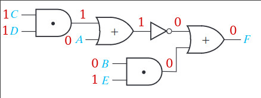
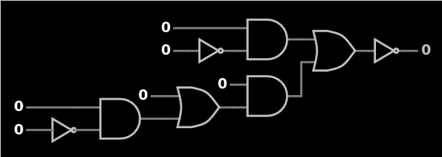
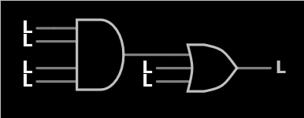
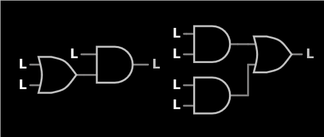
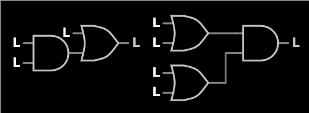
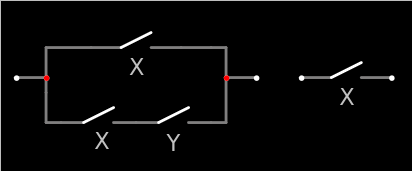
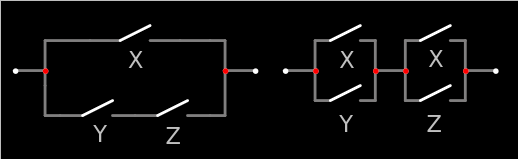

# Unit2 Boolean Algebra

## Contents

- Unit2 Boolean Algebra

    - 2.1 Introduction

    - 2.2 Basic Operations

    - 2.3 Boolean Expressions and Truth Tables

    - 2.4 Basic Theorems

    - 2.5 Commutative, Associative, Distributive, and DeMorgan's Laws

    - 2.6 Simplification Theorems

    - 2.7 Multiplying out and Factoring

    - 2.8 Complementing Boolean Expressions

## Objectives

1. Understand the basic operations and laws of Boolean algebra.

1. Relate these operations and laws to circuits composed of AND gates, OR gates, and INVERTERS. Also relate these operations and laws to circuits composed of switches.

1. Prove any of these laws in switching algebra using a truth table.

1. Apply these laws to the manipulation of algebraic expressions including:

    1. Multiplying out an expression to obtain a sum of products (SOP)

    1. Factoring an expression to obtain a product of sums (POS)

    1. Simplifying an expression by applying one of the laws

    1. Finding the complement of an expression

## Study Guide

### 2

#### a

- The symbols "0" and "1" used in Boolean algebra do not have a numeric value; instead they represent two different states in a logic circuit and are the two values of a switching variable.

#### d

- $1 + 1 = 1$

- $1 \cdot 0 = 1$

- $1 + 0 = 1$

- $1 \cdot 1 = 1$

#### e

- $1 \cdot 1 = 1$

- $0 + 0 = 0$

- $1 \cdot 0 = 0$

- $0 + 1 = 1$

### 3

#### a

- The number of variables is 4 and the number of literals is 10.

#### b

#### c

$$
\begin{aligned}
(CD + A)^\prime + BE
&= (1\cdot1 + 0)^\prime + 0\cdot1 \\
&= 0
\end{aligned}
$$

#### d

- $F = (A^\prime B)^\prime$

|$A\quad B$|$A^\prime$|$A^\prime B$|$(A^\prime B)^\prime$|
|-|-|-|-|
|0$\quad$ 0|1|0|1|
|0$\quad$ 1|1|1|0|
|1$\quad$ 0|0|0|1|
|1$\quad$ 1|0|0|1|

#### e

- $F = (A + B^\prime)C$

|$A\quad B\quad C$|$B^\prime$|$A+B^\prime$|$C(A+B\prime)$|
|-|-|-|-|
|0$\quad$ 0$\quad$ 0|1|1|0|
|0$\quad$ 0$\quad$ 1|1|1|1|
|0$\quad$ 1$\quad$ 0|0|0|0|
|0$\quad$ 1$\quad$ 1|0|0|0|
|1$\quad$ 0$\quad$ 0|1|1|0|
|1$\quad$ 0$\quad$ 1|1|1|1|
|1$\quad$ 1$\quad$ 0|0|1|0|
|1$\quad$ 1$\quad$ 1|0|1|1|

#### f

### 4

#### a

$$
X + 0 = X
$$

- If $X = 0$, $0 + 0 = 0, and if $X = 1$, $1 + 0 = 1$

$$
X + 1 = 1
$$

- If $X = 0$, $0 + 1 = 1, and if $X = 1$, $1 + 1 = 1$

#### b

- $AA = A$

- $A^\prime A = 0$

- $A\cdot0 = 0$

- $A\cdot1 = A$

- $A + A = A$

- $A^\prime + A = 1$

- $A + 0 = A$

- $A + 1 = 1$

#### c

$$
(AB^\prime + C)\cdot0 = 0
$$

- $X\cdot0=0$

$$
A(B + C^\prime)+1=1
$$

- $X+1=1$

$$
(BC^\prime+A)(BC^\prime+A) = BC^\prime +A
$$

- $XX = X$

$$
X(Y^\prime + Z) + [X(Y^\prime+Z)]^\prime=1
$$

- $X + X^\prime = 1$

$$
(X^\prime + YZ)(X^\prime +YZ)^\prime = 0
$$

- $XX^\prime = 0$

$$
D^\prime(E^\prime+F) + D^\prime(E^\prime+F) = D^\prime(E^\prime+F)
$$

- $X + X = X$

### 5

#### a

- $(X + Y) + Z = X + (Y + Z) = X + Y + Z$

#### b

- XY = YX

#### c

#### d

- $0 + 0 + 0 + 0 = 0$

- $1\cdot1\cdot0\cdot1 = 0$

- $0 + 0 + 1 + 0 = 1$

- $1\cdot1\cdot1\cdot1 = 1$

#### e

$$
X(Y + Z) = XY + YZ
$$

|$X\quad Y\quad Z$|$Y + Z$|$XY$|$XZ$|$X(Y+Z)$|$XY+XZ$|
|-|-|-|-|-|-|
|0$\quad$ 0$\quad$ 0|0|0|0|0|0|
|0$\quad$ 0$\quad$ 1|1|0|0|0|0|
|0$\quad$ 1$\quad$ 0|1|0|0|0|0|
|0$\quad$ 1$\quad$ 1|1|0|0|0|0|
|1$\quad$ 0$\quad$ 0|0|0|0|0|0|
|1$\quad$ 0$\quad$ 1|1|0|1|1|1|
|1$\quad$ 1$\quad$ 0|1|1|0|1|1|
|1$\quad$ 1$\quad$ 1|1|1|1|1|1|

#### f

- $X(Y+Z)=XY+XZ$

- $X + YZ = (X + Y)(X + Z)$

#### h

- $RS + T^\prime = (R + T^\prime)(S + T^\prime)$

### 6

#### a

|$X\quad Y$|$XY^\prime$|$XY^\prime + Y$|$X + Y$|
|-|-|-|-|
|0$\quad$ 0|0|0|0|
|0$\quad$ 1|0|1|1|
|1$\quad$ 0|1|1|1|
|1$\quad$ 1|0|1|1|

#### b

$$
(A + B)(DE)^\prime + DE = A + B + DE
$$

- $X + X^\prime Y = X + Y$, $X = DE$, $Y = A + D$

$$
AB^\prime + AB^\prime C^\prime D = AB^\prime
$$

- $X + XY = X$, $X = AB^\prime$, $Y = C^\prime D$

$$
(A^\prime + B)(CD + E^\prime) + (A^\prime + B)(CD + E^\prime)^\prime = A^\prime + B
$$

- $XY + XY^\prime = X$, $X = A^\prime + B$, $Y = CD + E^\prime$

$$
(A + BC^\prime + D^\prime E)(A + D^\prime E) = A + D^\prime E
$$

- $X(X + Y) = X$, $X = A + D^\prime E$, $Y = BC^\prime$

#### c

$$
\begin{aligned}
Z
&= (AB+CD)C((CD)^\prime + AB) \\
&= ABC
\end{aligned}
$$

#### d

- [Problem 2.1](#2.1)

- [Problem 2.2](#2.2)

- [Problem 2.3](#2.3)

- [Problem 2.4](#2.4)

### 7

#### a

- $AB^\prime + D^\prime EF^\prime + G$: SOP

- $(A + B^\prime C^\prime)(A^\prime + BC)$: None

- $AB^\prime(C^\prime + D + E^\prime)(F^\prime + G)$: POS

- $X^\prime Y + WX(X^\prime + Z) + A^\prime B^\prime C^\prime$: None

#### b

- If we apply the second distributive law before the ordinary distributive law, we can save a lotof time.

#### c

$$
\begin{aligned}
AD + B^\prime CD + B^\prime DE
&= D(A + B^\prime C + B^\prime E) \\
&= D(A +B^\prime(C + D)) \\
&= D(A + B^\prime)(A + C + D)
\end{aligned}
$$

#### d

- [Problem 2.5](#2.5)

- [Problem 2.6](#2.6)

- [Problem 2.7](#2.7)

### 8

#### a

$$
\begin{aligned}
&(B^\prime + D + E)(B^\prime + D + A)(AE + C^\prime) \\
&= (B^\prime + D + EA)(AE + C^\prime) \\
&= AE  + (B^\prime + D)C^\prime \\
&= AE + B^\prime C^\prime + DC^\prime
\end{aligned}
$$

$$
\begin{aligned}
&AE + B^\prime C^\prime + DC^\prime \\
&= AE + C^\prime(B + D) \\
&= (AE + C^\prime)(AE + B + D) \\
&= (A + C^\prime)(E + C^\prime)(A + B + D)(E + B + D)
\end{aligned}
$$

#### b

$$
\begin{aligned}
&(A + C^\prime)(B^\prime + D)(C^\prime + D^\prime)(C + D)E \\
&= (C^\prime + AD^\prime)(B^\prime + D)(C + D)E \\
&= (C^\prime + AD^\prime)(D + B^\prime C)E \\
&= ((C^\prime + AD^\prime)D + (C^\prime + AD^\prime)B^\prime C)E \\
&= (C^\prime D + AD^\prime B^\prime C)E \\
&= C^\prime DE + AD^\prime B^\prime CE
\end{aligned}
$$

$$
\begin{aligned}
&C^\prime DE + AD^\prime B^\prime CE \\
&= E(C^\prime D + AD^\prime B^\prime C) \\
&= E(C^\prime D + D^\prime B^\prime D + AD^\prime B^\prime C + ACC^\prime) \\
&= E(D(C^\prime + D^\prime B^\prime) + AC(C^\prime + D^\prime B^\prime)) \\
&= E(C^\prime + D^\prime B^\prime)(D + AC) \\
&= E(C^\prime + D^\prime)(C^\prime + B^\prime)(D + A)(D + C)
\end{aligned}
$$

### 10

#### a

$$
(ab^\prime c^\prime)^\prime = a^\prime + b + c
$$

#### b

$$
(a^\prime + b + c + d^\prime)^\prime = ab^\prime c^\prime d
$$

#### c

$$
(a^\prime + bc)^\prime = a(bc)^\prime = a(b^\prime + c^\prime)
$$

#### d

$$
\begin{aligned}
(a^\prime b^\prime + cd)^\prime &= (a^\prime b^\prime)^\prime(cd)^\prime \\
&=(a + b)(c^\prime + d^\prime)
\end{aligned}
$$

#### e

$$
\begin{aligned}
[a(b^\prime + c^\prime d)]^\prime
&= a^\prime + (b^\prime + c^\prime d)^\prime \\
&= a^\prime + b(c^\prime d)^\prime \\
&= a^\prime + b(c + d^\prime)
\end{aligned}
$$

### 11

#### a

$$
(a^\prime + b + c)^\prime = ab^\prime c^\prime
$$

#### b

$$
(ab^\prime c^\prime d)^\prime = a^\prime + b + c + d^\prime
$$

#### c

$$
\begin{aligned}
(a(b^\prime + c^\prime))^\prime
&= a^\prime + (b^\prime + c^\prime)^\prime \\
&= a^\prime + bc
\end{aligned}
$$

#### d

$$
\begin{aligned}
((a + b)(c^\prime + d^\prime))^\prime
&= (a + b)^\prime + (c^\prime + d^\prime)^\prime \\
&= a^\prime b^\prime + cd 
\end{aligned}
$$

#### e

$$
\begin{aligned}
(a^\prime + b(c + d^\prime))^\prime
&= a(b(c + d^\prime))^\prime \\
&= a(b +  (c + d^\prime)^\prime) \\
&= a(b^\prime + c^\prime d)
\end{aligned}
$$

### 12

$$
F^\prime = (a + b^\prime)(b + c^\prime)
$$

|$a\quad b\quad c$|$a^\prime b$|$b^\prime c$|$a^\prime b + b^\prime c$|$(a + b^\prime)$|$(b + c^\prime)$|$F^\prime$|
|-|-|-|-|-|-|-|
|0$\quad$ 0$\quad$ 0|0|0|0|1|1|1|
|0$\quad$ 0$\quad$ 1|0|1|1|1|0|0|
|0$\quad$ 1$\quad$ 0|1|0|1|0|1|0|
|0$\quad$ 1$\quad$ 1|1|0|1|0|1|0|
|1$\quad$ 0$\quad$ 0|0|0|0|1|1|1|
|1$\quad$ 0$\quad$ 1|0|1|1|1|0|0|
|1$\quad$ 1$\quad$ 0|0|0|0|1|1|1|
|1$\quad$ 1$\quad$ 1|0|0|0|1|1|1|

### 13

$$
\begin{aligned}
F
&= (X + Y)^\prime(W + Z) \\
&= X^\prime Y^\prime(W + Z)
\end{aligned}
$$

### 14

- [Problem 2.8](#2.8)

- [Problem 2.9](#2.9)

### 15

$$
\begin{aligned}
(M + N^\prime)P^\prime &= MN^\prime + P^\prime
\end{aligned}
$$

## Problems

### 2.1

#### a

$$
\begin{aligned}
X(X^\prime + Y)
&= XX^\prime + XY \\
&= 0 + XY = XY
\end{aligned}
$$

#### b

$$
\begin{aligned}
X + XY 
&= X(1 + Y) \\
&= X\cdot1 = X
\end{aligned}
$$

#### c

$$
\begin{aligned}
XY + XY^\prime
&= X(Y + Y^\prime) \\
&= X\cdot1 = X
\end{aligned}
$$

#### d

$$
\begin{aligned}
(A+B)(A+B^\prime)
&= A + BB^\prime \\
&=A + 0 = A
\end{aligned}
$$

### 2.2

#### a

- If X is closed, both circuits have a transmission of 1.

#### b

- If X is closed or both Y and Z are closed, both circuits have a transmission of 1.

### 2.3

#### a

- $X^\prime Y^\prime Z + (X^\prime Y^\prime Z)^\prime = 1$

- $X + X^\prime = 1$

#### b

- $(AB^\prime + CD)(B^\prime E + CD) = CD + AB^\prime E$

- Distributive laws

#### c

- $ACF + AC^\prime F = AF$

- $XY + XY^\prime = X$

#### d

- $A(C + D^\prime B) + A^\prime = C + D^\prime B + A^\prime$

- $X + X^\prime Y = X + Y$

#### e

- $(A^\prime B + C + D)(A^\prime B + D) = A^\prime B + D$

- $X(X + Y) = X$

#### f

- $(A + BC) + (DE + F)(A + BC)^\prime = A + BC + DE + F$

- $X + X^\prime Y$

### 2.4

#### a

$$
\begin{aligned}
F
&= ((A\cdot1 + A\cdot1) + E) + (BC)D \\
&= AE + BCD
\end{aligned}
$$

#### b

$$
\begin{aligned}
Y
&= (AB^\prime + (B + AB))B + A \\
&= A + B
\end{aligned}
$$

### 2.5

#### a

$$
\begin{aligned}
&(A + B)(C + B)(D^\prime + B)(ACD^\prime + E) \\
&= (B + ACD^\prime)(ACD^\prime + E) \\
&= ACD^\prime + BE
\end{aligned}
$$

#### b

$$
\begin{aligned}
&(A^\prime + B + C^\prime)(A^\prime + C^\prime + D)(B^\prime + D^\prime) \\
&= (A^\prime + C^\prime + BD)(B^\prime + D^\prime) \\
&=(A^\prime + C^\prime  + BD)BD \\
&= BD
\end{aligned}
$$

### 2.6

#### a

$$
\begin{aligned}
AB + C^\prime D^\prime
&= (AB + C^\prime)(AB + D^\prime) \\
&= (A + C^\prime)(B + C^\prime)(A + D^\prime)(B + D^\prime)
\end{aligned}
$$

#### b

$$
\begin{aligned}
&WX + WY^\prime X + ZYX \\
&= X(W + WY^\prime + ZY) \\
&= X(W + ZY) \\
&= X(W + Z)(W + Y)
\end{aligned}
$$

#### c

$$
\begin{aligned}
&A^\prime BC + EF + DEF^\prime \\
&= A^\prime BC + E(F + DF^\prime) \\
&= A^\prime BC + E(F + D) \\
&= (A^\prime BC +E)(A^\prime BC + F + D) \\
&= (A^\prime + E)(B + E)(C + E)(A^\prime + F + D)(B + F + D)(C + F + D)
\end{aligned}
$$

#### d

$$
\begin{aligned}
&XYZ + W^\prime Z + XQ^\prime Z \\
&= Z(XY + W^\prime + XQ^\prime) \\
&= Z(X(Y + Q^\prime) + W^\prime) \\
&= Z(X + W^\prime)(Y + Q^\prime + W^\prime)
\end{aligned}
$$

#### e

$$
\begin{aligned}
&ACD^\prime + C^\prime D^\prime + A^\prime C \\
&= D^\prime(AC + C^\prime) + A^\prime C \\
&= D^\prime(A + C^\prime) + A^\prime C \\
&= (D + A^\prime C)(A+ C^\prime + A^\prime C) \\
&= (D + A^\prime)(D + C)(A + C + C^\prime) \\
&= (D + A^\prime)(D + C)
\end{aligned}
$$

#### f

$$
\begin{aligned}
A + BC + DE &=
(A + B)(A + C) + DE \\
&= (A + B + DE)(A + C + DE) \\
&= (A + B + D)(A + B + E)(A + C + D)(A + C + E)
\end{aligned}
$$

### 2.7

#### a

$$
\begin{aligned}
&(A + B + C + D)(A + B + C + E)(A + B + C + F) \\
&= A + B + C  + DEF
\end{aligned}
$$

#### b

$$
\begin{aligned}
&WXYZ + VXYZ + UXYZ \\
&= XYZ(W + V + U)
\end{aligned}
$$

### 2.8

#### a

$$
\begin{aligned}
[(AB)^\prime + C^\prime D]^\prime
&= AB(C^\prime D)^\prime \\
&= AB(C + D^\prime)
\end{aligned}
$$

#### b

$$
\begin{aligned}
[A + B(C^\prime + D)]^\prime
&= A^\prime(B(C^\prime + D))^\prime \\
&= A^\prime(B^\prime + (C^\prime + D)^\prime) \\
&= A^\prime(B^\prime + CD^\prime) \\
&= A^\prime(B^\prime + C)(B^\prime + D^\prime)
\end{aligned}
$$

#### c

$$
\begin{aligned}
&((A + B^\prime)C)^\prime(A + B)(C + A)^\prime \\
&= ((A + B^\prime)^\prime + C^\prime)(A + B)C^\prime A^\prime \\
&=(A^\prime B + C^\prime)B^\prime C^\prime A^\prime \\
&= B^\prime C^\prime A^\prime
\end{aligned}
$$

### 2.9

#### a

$$
\begin{aligned}
F
&= ((A + B)^\prime + ((A + B)^\prime + A)^\prime)((A + B)^\prime + A)^\prime \\
&= ((A + B)^\prime + A)^\prime \\
&= (A + B)A^\prime \\
&= BA^\prime
\end{aligned}
$$

#### b

$$
\begin{aligned}
G
&= (((R + S + T)^\prime P((R + S)^\prime + T))^\prime T)^\prime \\
&= (R + S + T)^\prime P((R + S)^\prime + T) + T^\prime \\
&= R^\prime S^\prime T^\prime P (R^\prime S^\prime + T) + T^\prime \\
&= R^\prime S^\prime T^\prime P + T^\prime
\end{aligned}
$$
